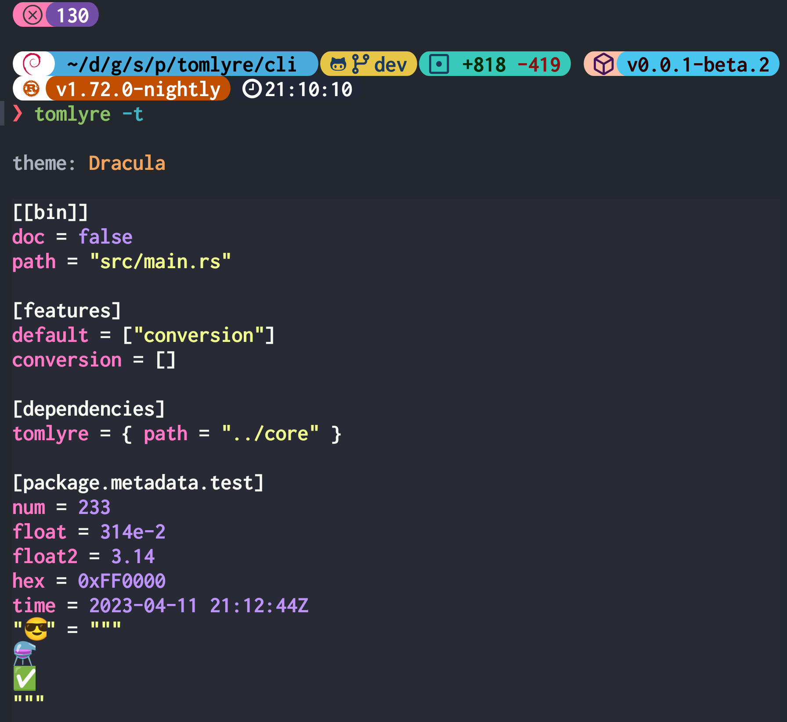

# hlight

 

Dedicated to delivering exceptional syntax highlighting capabilities.

> v0.0.0 simply encapsulated [syntect](https://docs.rs/syntect).
> ~~Considering that regex is very slow. Maybe someday, I will handwrite lexers and parsers for some languages.~~

## Usage

[hlight/readme](hlight/Readme.md)

[hlight-dump/readme](hlight-dump/Readme.md)

## Preview

<table>
  <tr>
    <td></td>
    <td></td>
  </tr>
</table>

<table>
  <tr>
      <td></td>
      <td></td>
  </tr>
</table>

<table>
  <tr>
      <td></td>
      <td></td>
  </tr>
</table>

<table>
  <tr>
      <td></td>
      <td></td>
  </tr>
</table>

<table>
  <tr>
    <td></td>
    <td></td>
  </tr>
</table>

<table>
  <tr>
    <td></td>
    <td></td>
  </tr>
</table>
