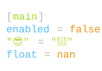

# hlight

A library for output syntax highlighting.

## ChangeLog

[Changelog.md](Changelog.md)

## Quick Start

### add dependency

```sh
cargo add hlight
```

### print to stdout

```rust
use hlight::{Highlighter, theme::names::ayu_dark, HighlightResource};


let s: &str = r#"
[main]
enabled = false
"😎" = "🍥"
float = nan
"#;

let res = HighlightResource::default()
  .with_background(false)
  .with_theme_name(ayu_dark());

let _ = Highlighter::default()
  .with_syntax_name("toml")
  .with_content(s)
  .with_resource(Some(&res))
  .run();
```

output:



### write to file

```rust
use std::fs::File;

use hlight::{Highlighter, HighlightResource, theme::names::ayu_dark};

let s: &str = r#"
[main]
enabled = false
"😎" = "🍥"
float = nan
"#;

let res = HighlightResource::default()
  .with_background(false)
  .with_theme_name(ayu_dark());

let mut file = File::create("tmp.txt").expect("Failed to create test.txt");

let _ = Highlighter::default()
  .with_syntax_name("toml")
  .with_content(s)
  .with_resource(Some(&res))
  .with_writer(Some(&mut file))
  .run();
```

## Advanced

### Load custom set

> The `["preset-syntax-set", "preset-theme-set"]` features are enabled by default. If you want to customize the set, you don't need to enable these features.

disable default features:

```sh
cargo add hlight --no-default-features
```

#### theme-set

```rust
use hlight::{HighlightResource, theme::load_theme_set};

const THEMES: &[u8] = include_bytes!(concat!(
  env!("CARGO_MANIFEST_DIR"),
  "/assets/set/theme.packdump"
));

fn show_theme_set(set: &HlightThemeSet) {
  set
    .get_inner()
    .themes
    .keys()
    .for_each(|k| println!("{k}"))
}

let set = load_theme_set(Some(THEMES));

let res = HighlightResource::default()
  .with_theme_set(set.into())
  .with_theme_name("Custom-theme-name".into());

show_theme_set(res.get_theme_set())
```

#### syntax-set

```rust
use std::sync::OnceLock;

use hlight::{
  HighlightResource,
  syntax::{SyntaxSet, load_syntax_set},
};

const SYNTAXES: &[u8] = include_bytes!(concat!(
  env!("CARGO_MANIFEST_DIR"),
  "/assets/set/syntax.packdump"
));

fn static_syntax_set() -> &'static SyntaxSet {
  static S: OnceLock<SyntaxSet> = OnceLock::new();
  S.get_or_init(|| load_syntax_set(Some(SYNTAXES)))
}

fn show_syntax_set(set: &SyntaxSet) {
  for (name, ext) in set
    .syntaxes()
    .iter()
    .map(|x| (&x.name, &x.file_extensions))
  {
    println!(
      "name: {name}\n\
      ext: {ext:?}\n---"
    )
  }
}

let res = HighlightResource::default()
  .with_syntax_set(Cow::Borrowed(static_syntax_set()));

show_syntax_set(res.get_syntax_set())
```
